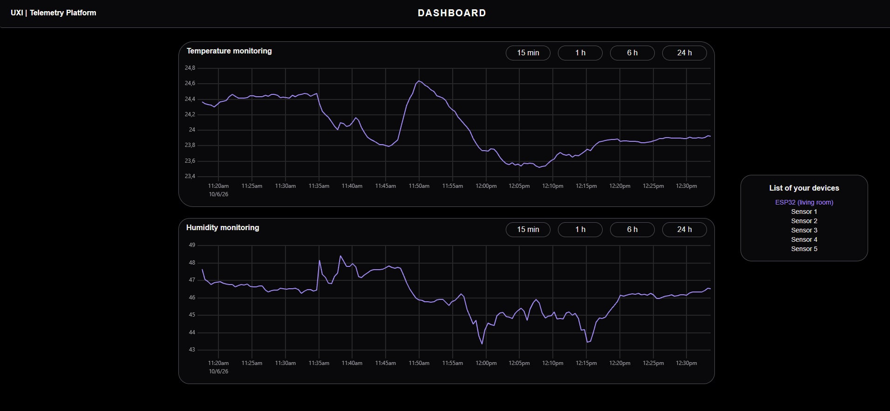
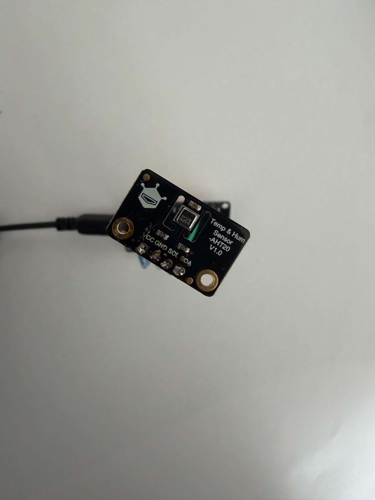
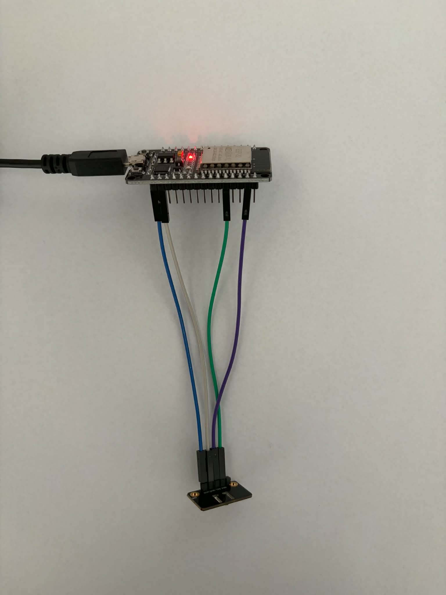

# Telemetry platform

Temperature and humidity from physical and simulated devices, over MQTT, into a time-series
database, out through an API and onto a dashboard.

Live at [panel.rafaltrzeciakowski.dev](https://panel.rafaltrzeciakowski.dev). Click *Guest*
to look around. One of the devices in that list is an ESP32 on my desk; the rest are simulated.



## How the data moves

```
device ──MQTT──▶ Mosquitto ──▶ ingest ──BullMQ──▶ Redis ──▶ worker ──SQL──▶ TimescaleDB
                                                                                │
browser ──HTTPS──▶ Next.js on Vercel ──HTTPS──▶ Cloudflare Tunnel ──▶ NestJS API ┘
```

Mosquitto is the only place a device touches the system. Every device gets its own account
through dynamic security, with an ACL that allows publishing to exactly one topic, and a pinned
client id. A stolen device credential can write as that device and nothing else.

The ingest process subscribes, validates the payload with Zod and pushes it onto a queue. It never
touches the database, so a slow write backs up the queue instead of losing messages at the
broker.

The worker drains the queue in batches and writes one `INSERT` per batch. Duplicates are the
normal consequence of MQTT QoS 1, so they collide on the primary key and get counted rather
than treated as failures.

TimescaleDB stores measurements in a hypertable with hourly and daily continuous
aggregates above it. A query picks its layer from the length of the window: raw rows for a
few hours, the hourly rollup up to a month, the daily rollup beyond that. A full year comes
back as 365 rows rather than the 31 million behind them, and the dashboard offers ranges
from 15 minutes to a year so every layer gets used.

The NestJS API serves device lists, time series and a live SSE stream, checking a JWT and
device ownership on every request.

Cloudflare Tunnel holds an outbound connection. The server has no inbound port open except
SSH, and MQTT reaches it over WebSockets through the same tunnel.

## Built with

| | |
|---|---|
| Device | ESP32 (ESP-WROOM-32), AHT20 over I2C, ESP-IDF 5.3.2, C |
| Broker | Eclipse Mosquitto 2, dynamic security, MQTT and MQTT over WebSockets |
| Ingest and worker | Node 22, TypeScript 5.9, mqtt.js 5, Zod 4, BullMQ 6 on Redis 7, pino 10 |
| Storage | TimescaleDB on PostgreSQL 17, Drizzle ORM 0.45 |
| API | NestJS 12, Zod, SSE, Vitest 4 with Testcontainers 12 |
| Dashboard | Next.js 16, React 19, Tailwind 4, uPlot 1.6 |
| Deployment | Docker Compose, GitHub Actions building arm64 images into GHCR, Oracle Cloud ARM, Cloudflare Tunnel, Vercel |

## Numbers

All of these were measured while the project was being built, against the running system.

| | |
|---|---|
| Rows stored | 5.4 M across 6 devices, 912 MB |
| Device to server | 63 ms on the LAN, 93 to 155 ms through Cloudflare |
| WiFi stack | 35 KiB of heap |
| TLS and MQTT client | 45 KiB of heap, leaving 165 KiB |
| 120 s broker outage | 0 measurements lost with the buffer, 93 without it |
| 6 h 11 min unattended | 22 290 of 22 300 samples delivered, 0.045 % lost |
| Series query | 74 ms over 6 h of raw rows, 33 ms over a month, 47 ms over a year |
| Retention | compress after 7 days, drop after 1 year |

The firmware buffers up to 500 samples while offline and timestamps them from a monotonic
clock, so measurements taken during an outage arrive with the time they were taken rather than
the time they were sent.

## Run it locally

Requires Docker and Node 22.

```bash
cp .env.example .env     # fill in the empty values
docker compose up -d
```

With the demo fleet of simulated devices:

```bash
docker compose --profile demo up -d
```

The API listens on `localhost:4300`. The panel runs separately:

```bash
cd web && npm install && npm run dev
```

## Connect your own ESP32

You need an ESP32 and an AHT20 on I2C. Four wires, going by the labels printed on both
boards:

| AHT20 | ESP32 |
|---|---|
| VCC | 3V3 |
| GND | GND |
| SDA | GPIO21 |
| SCL | GPIO22 |

Power the sensor from the pin marked `3V3`. The ESP32 also has a pin marked `VIN`, which
carries 5 V from USB; the sensor would run from it, but its pull-ups would then hold the
I2C lines at 5 V, and the ESP32 inputs are not 5 V tolerant.

<p align="center">
  
  
</p>

Create a device in the panel. It shows the broker address, username, client id, password and
topic once. The password is generated with `randomBytes(24)` and never stored in the clear, so
it cannot be shown again.

Put those values in `firmware/nvs.csv`:

```
key,type,encoding,value
device,namespace,,
wifi_ssid,data,string,YOUR_NETWORK
wifi_pass,data,string,YOUR_PASSWORD
dev_id,data,string,dev_xxxxxxxx
dev_pass,data,string,PASSWORD_FROM_THE_PANEL
broker_uri,data,string,wss://mqtt.rafaltrzeciakowski.dev/mqtt
```

Then build the firmware and the credentials partition, and flash both:

```bash
cd firmware
idf.py set-target esp32 && idf.py build && idf.py -p /dev/ttyUSB0 flash
python $IDF_PATH/components/nvs_flash/nvs_partition_generator/nvs_partition_gen.py \
  generate nvs.csv nvs.bin 0x6000
python -m esptool --port /dev/ttyUSB0 write_flash 0x9000 nvs.bin
```

Credentials live in the NVS partition rather than in the build, so one binary serves every
device and the image you hand to someone else carries no secrets. The board publishes a sample
per second; the first row reaches the database about five seconds after power-on.

Tested with ESP-IDF 5.3.2.

## Layout

```
src/            simulator, MQTT ingest, queue worker
api/            NestJS API
web/            Next.js dashboard
firmware/       ESP-IDF firmware for the ESP32
sql/            TimescaleDB migrations
docs/adr/       architecture decision records
```

## Decisions

The reasoning behind the parts that are not obvious is in [docs/adr](docs/adr): two timestamps
instead of one, a queue between the broker and the database, deduplication in the database
rather than the application, chunk sizing, and why the primary key had to grow.
